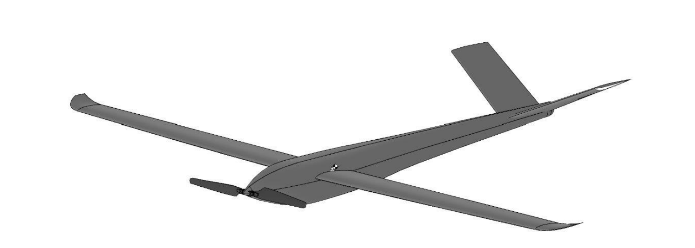

# Senior Aircraft Capstone

## Overview
Preliminary search-and-rescue (SAR) aircraft design project focused on drag analysis, airfoil selection, and wing design. Worked as the Drag Analysis and Wing Design Lead on a multidisciplinary team to evaluate aerodynamic performance, estimate drag buildup, and support preliminary sizing for a fixed-wing SAR drone concept.

## Project Context
Completed as part of a senior aircraft design capstone at Penn State during August 2025 to Present.

## Role
**Drag Analysis and Wing Design Lead**

## Tools & Methods
- XFOIL
- OpenVSP / VSPAero
- SolidWorks
- Aerodynamic drag buildup
- Airfoil performance analysis
- Wing geometry development
- Preliminary aircraft design trade studies

## Key Results
- Computed parasitic drag coefficient of **CD0 = 0.059** and Oswald efficiency factor of **e0 = 0.833** for a **47.5 lb** SAR drone with a **9.6 ft wingspan** and **aspect ratio of 17.28**
- Selected and analyzed the **SD7037 airfoil** at **Re ≈ 600,000** and **M ≈ 0.15**
- Identified minimum drag of **CD = 0.00527** at **CL = 0.363** and stall at **12° angle of attack**
- Modeled wing geometry in SolidWorks targeting **less than 6 inches of tip deflection**
- Contributed to a preliminary aircraft concept achieving **685 nmi range**, **17.36 hr endurance**, and **2,864 fpm maximum rate of climb** with a **5 BHP Wankel engine**

## Notes
This repository contains only shareable project material.

## Figures

### UAV 3D View

### UAV Constraint Diagram

